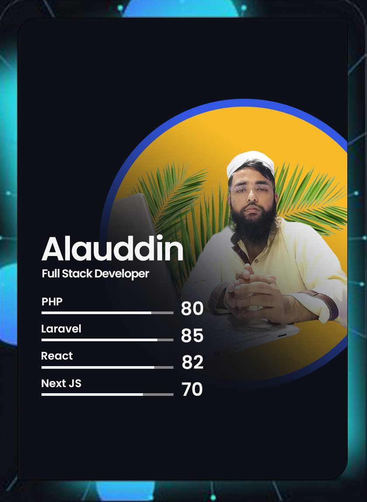

<a id="top"></a>

### Hi there, I'm Alauddin Jahin 👋

## Senior Full Stack Developer | Javascript Lover

 :mailbox: reach me out

[](https://alauddinjahin.github.io)
<!-- []() -->


<div>

 <div>
 
 </div>

 <div>
  
I'm a **Senior Full Stack Developer** currently working in a software company. My journey in software development has been fueled by a deep passion for learning and collaboration.

- 🌱 **Currently Learning:** All things tech, with a focus on AI & ML, Deep Learning, and IoT.
- 👯 **Looking to Collaborate:** Open to opportunities with IT companies or developer teams.
- 🥅 **2024-2025 Goals:** Contribute to Open Source projects, especially in 🚀 *AI & ML*, <br/> 🤖 *Deep Learning*, 🌐 *IoT*
- 📫 **Contact:** dev.alauddinjahin@gmail.com | mdalauddinjahin365@gmail.com
- ⚡ **Fun Fact:** I love reading books and listening to the Holy Quran.

 </div>

</div>


### 🌟 Aj vs Dark Theme

I have developed a "Aj vs Theme" dark theme. To use this extension:

1. Go to the extension tab and search "Aj vs Theme" and install it.
2. OR press `Ctrl/Command + Shift + P` to launch the command palette, then run:
```
  ext install MdAlauddinJahin.aj-vs-theme
```

### Playing 🎧

[]()

 <script>
    var audio = new Audio('./bg-sound.mp3?raw=true');
    audio.play();
</script>


### Connect with me:

[][website]
[][youtube]
[][twitter]
[][linkedin]
[][facebook]


<br />

### Languages and Tools:

[][webdevplaylist]
[][webdevplaylist]
[][cssplaylist]
[][cssplaylist]
[][jsplaylist]
[][jsplaylist]
[][reactplaylist]
[][webdevplaylist]
[][webdevplaylist]
[][webdevplaylist]
[][webdevplaylist]
[][webdevplaylist]
[][webdevplaylist]
[][webdevplaylist]
[][webdevplaylist]
[][webdevplaylist]
[][webdevplaylist]
[][webdevplaylist]
[][webdevplaylist]

<br />
<br />


#### Profile Visits 


---

<details>
  <summary>:zap: More stuff about me</summary>

  <br >

  I love sharing knowledge and putting tutorials and posts together for helping other developers, and that's why "CodeWithLove 360" Training exists!

  #### Coding Stats 

  <!--START_SECTION:waka-->

```text
No activity tracked
```

<!--END_SECTION:waka-->
 
[](https://github.com/alauddinjahin)
 
  #### Github Stats

  


</details>


[Go to top ⬆️ ](#top)


[website]: https://alauddinjahin.github.io
[course]: https://www.facebook.com/groups/490697088749195
[facebookGroup]: https://www.facebook.com/groups/490697088749195
[facebook]: https://www.facebook.com/alauddinjahin
[twitter]: https://twitter.com/alauddinjahin
[youtube]: https://www.youtube.com/channel/UCiBzt9auvNX9VlC5kaFvTaQ
[linkedin]: https://www.linkedin.com/in/alauddina-jahin-8008b1183
[webdevplaylist]:https://alauddinjahinb.github.io
[cssplaylist]:https://alauddinjahinx.github.io
[jsplaylist]:https://alauddinjahinx.github.io
[reactplaylist]:https://alauddinjahinx.github.io


